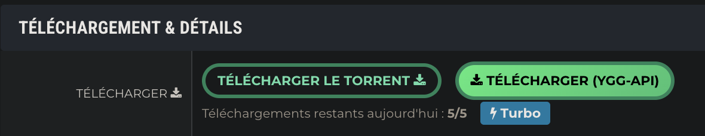

<p align="center">
  
</p>

# YGGMollo - Extension Firefox

Extension Firefox qui ajoute un bouton pour télécharger les torrents YGGTorrent via [Ygg-API](https://yggapi.eu).

> Fork et portage Firefox (Manifest V3) de l'extension Chrome originale par [Almottier](https://github.com/almottier/YGGMollo)



## Installation

### Firefox (temporaire pour développement)

1. Ouvrez Firefox et allez sur `about:debugging`
2. Cliquez sur **"Ce Firefox"** → **"Charger un module complémentaire temporaire..."**
3. Sélectionnez le fichier `manifest.json`

### Configuration

1. Ouvrez les **Options** de l'extension
2. Entrez votre **passkey YGGTorrent** (disponible dans votre profil YGGTorrent)
3. Cliquez sur **Enregistrer**

Vous verrez maintenant un bouton "Télécharger (Ygg-API)" sur les pages de torrents YGGTorrent.

## Développement

```bash
make build    # Crée build/yggmollo-firefox-v1.0.0.zip
make clean    # Nettoie le dossier build
```

## Licence

MIT
