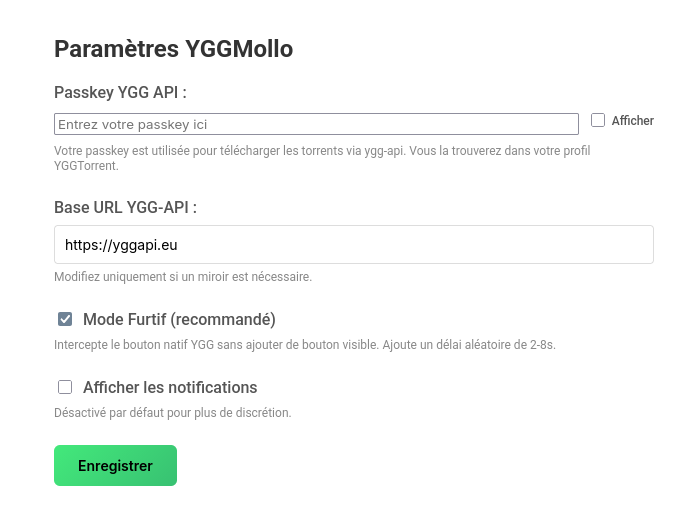

<p align="center">
  
</p>

# YGGMollo - Extension Firefox

[](https://github.com/eberess/YGGMollo-Firefox/releases/latest)

Extension Firefox qui permet de télécharger les torrents YGGTorrent via [Ygg-API](https://yggapi.eu) en mode furtif.

> Fork et portage Firefox (Manifest V3) de l'extension Chrome originale par [Almottier](https://github.com/almottier/YGGMollo)


## 📸 Interface

### Page d'options


*Configuration de la passkey, du mode furtif et des notifications*

## ⚠️ AVERTISSEMENT IMPORTANT

**Risque de bannissement** : L'utilisation d'API tierces ou d'extensions pour télécharger des torrents peut être détectée par YGGTorrent et entraîner un bannissement de votre compte. 

**Utilisez cette extension à vos risques et périls.** Le mode furtif réduit les traces mais ne garantit pas l'anonymat total.

**Recommandations** :
- ✅ Utilisez le **Mode Furtif** (activé par défaut)
- ✅ Désactivez les **notifications** (désactivées par défaut)
- ⚠️ Ne partagez pas votre passkey
- ⚠️ Utilisez avec modération

## Installation

### Méthode recommandée (XPI signé, permanent)

1. Téléchargez le XPI signé depuis la dernière release:
   - https://github.com/eberess/YGGMollo-Firefox/releases/latest
   - Exemple de fichier: `5471eef6ded541079b6e-1.0.0.xpi`
2. Dans Firefox, ouvrez `about:addons`
3. Cliquez sur la roue dentée → "Installer un module depuis un fichier…"
4. Sélectionnez le fichier `.xpi` téléchargé → Validez

L’extension est installée de façon permanente (signée AMO, persiste après redémarrage).

### Méthode alternative (développement, temporaire)

1. Ouvrez Firefox et allez sur `about:debugging`
2. Cliquez sur **"Ce Firefox"** → **"Charger un module complémentaire temporaire..."**
3. Sélectionnez le fichier `manifest.json`

### Configuration

1. Ouvrez les **Options** de l'extension
2. Entrez votre **passkey YGGTorrent** (disponible dans votre profil YGGTorrent)
3. **Configurez les options** :
   - ✅ **Mode Furtif** (activé par défaut, recommandé) : Intercepte le bouton natif YGG sans ajouter de bouton visible
   - ☑️ **Notifications** (désactivées par défaut) : Affiche une notification lors du téléchargement
4. Cliquez sur **Enregistrer**

## 🎯 Fonctionnement

### Mode Furtif (recommandé - v1.1.0+)

**Comment ça marche** :
- L'extension **n'ajoute AUCUN bouton visible** sur la page
- Elle intercepte le clic sur le **bouton de téléchargement natif** de YGGTorrent
- Ajoute un **délai aléatoire de 2-8 secondes** (simule un comportement humain)
- Télécharge via yggapi.eu en arrière-plan
- **Zéro trace** dans le DOM ou la console

**Avantages** :
- 👻 Totalement invisible pour le site
- ⏱️ Pas de timer d'attente YGG
- 🔒 Maximum de discrétion
- 🎲 Comportement aléatoire (anti-détection)

**Utilisation** :
1. Allez sur une page de torrent YGGTorrent
2. Cliquez sur le bouton de téléchargement **normal** (celui de YGG)
3. Attendez 2-8 secondes (délai aléatoire)
4. Le téléchargement démarre automatiquement via yggapi.eu

## Mises à jour

- Cette extension n’est pas listée sur AMO (non publiée publiquement) : il n’y a donc pas de mise à jour automatique via le store.
- Pour mettre à jour, téléchargez simplement le dernier fichier XPI depuis la page Releases, puis réinstallez-le via `about:addons` → roue dentée → "Installer un module depuis un fichier…".
- Les versions sont numérotées (ex: 1.0.0, 1.0.1, …). Pensez à remplacer l’ancienne version par la nouvelle.
- Note pour testeurs: si vous rencontrez un souci après mise à jour, supprimez l’ancienne extension puis installez la nouvelle XPI.

## Développement

```bash
make build    # Crée build/yggmollo-firefox-v1.1.0.zip
make clean    # Nettoie le dossier build
```

## Changelog

### v1.1.0 (2025-12-25)
- ✨ **Mode Furtif** : Intercepte le bouton natif sans ajouter de bouton visible
- 🎲 Délai aléatoire de 2-8 secondes pour simuler un comportement humain
- 🔕 Notifications désactivées par défaut
- 🚫 Suppression de tous les logs console
- 🔒 Maximum de discrétion pour réduire les risques de détection

### v1.0.2
- 🐛 Corrections mineures

### v1.0.0
- 🎉 Version initiale
- ➕ Ajout d'un bouton "Télécharger (Ygg-API)" sur les pages YGG

## Licence

MIT
